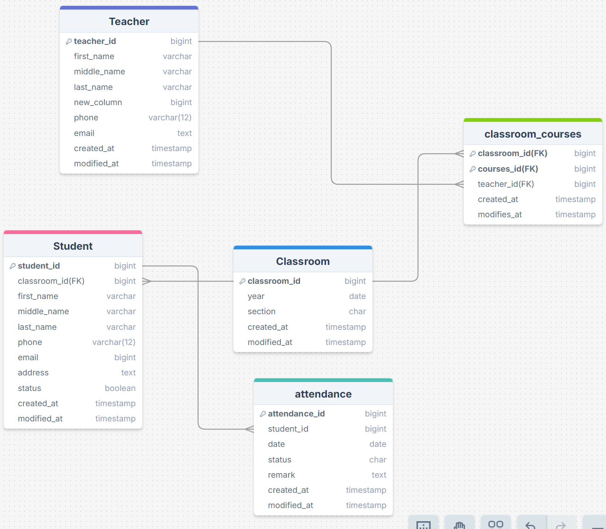

### Project Name:
School Management System

### Project Description:
A web-based school management system built using Django. The system provides interfaces for managing students, teachers, classrooms, and attendance records. It simplifies daily operations by offering essential tools for school administration.

### Features

- **Student management**  
  Add, update, delete, list, search, and filter students by classroom.

- **Teacher management**  
  Full CRUD functionality for managing teachers.

- **Classroom management**  
  Full CRUD functionality for managing classrooms.

- **Daily attendance tracking per classroom**  
  Record and save attendance manually for each classroom.

- **Attendance report per student and by date**  
  View detailed attendance records filtered by student and date.

- **Dashboard with key statistics**  
  Displays total number of students, teachers, classes, and attendance rate.

- **Sidebar navigation for main modules**  
  Quick access to Students, Teachers, Classes, Attendance, and other pages.

- **About page**  
  Includes school location (Google Maps embed), principal contact number, and email.

## UML for the model `Teacher` &  `Student` & `Classroom` & `attendance` & `classroom_courses` Model 

## User Stories 

- As an admin, I want to add a new teacher with their details (name, phone, email) so I can assign them to classrooms.

- As an admin, I want to add a new student and assign them to a classroom so they are registered in the system.

- As an admin, I want to create a new classroom with a year and section so I can organize students and teachers.

- As an admin, I want to update or delete teacher, student, or classroom data so I can keep the system up to date.

- As an admin, I want to record daily attendance for each student so I can track who is present or absent.

- As an admin, I want to generate attendance reports by student or date so I can monitor attendance.

